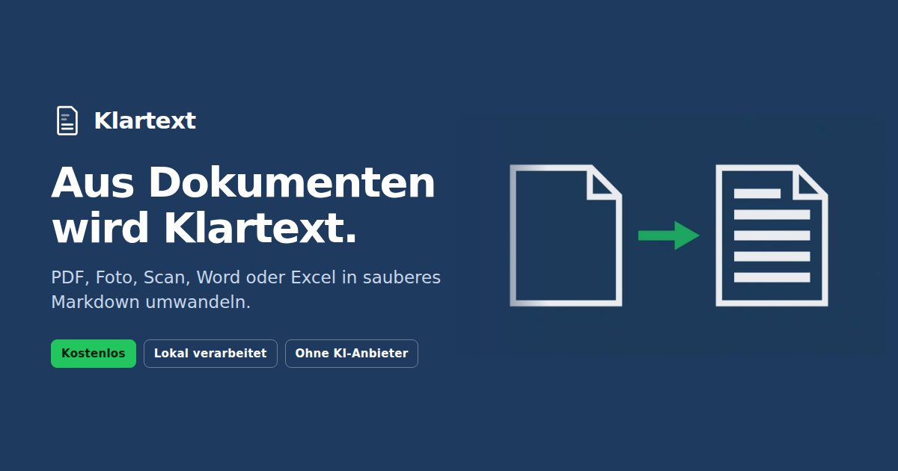

<div align="center">


# Klartext

**Dokumente, Scans und Fotos werden sauberes Markdown.**
Selbst gehostet, ohne KI-Anbieter, dauerhaft kostenlos.

[](tests/e2e.py)
[](THIRD_PARTY_LICENSES.md)
[](THIRD_PARTY_LICENSES.md)
[](SECURITY.md)
[](https://klartext.it-handwerk-stuttgart.de)

[Live ansehen](https://klartext.it-handwerk-stuttgart.de) ·
[Architektur](ARCHITECTURE.md) ·
[Betrieb](DEPLOYMENT.md) ·
[Sicherheit](SECURITY.md) ·
[Lizenzen](THIRD_PARTY_LICENSES.md)

</div>

---

PDF, Foto, Scan, Word, Excel oder PowerPoint hochladen — heraus kommen zwei Dateien:
lesbares **Markdown** zum Weiterverwenden und strukturtreues **JSON** für die
maschinelle Weiterverarbeitung. Die Umwandlung läuft vollständig auf dem eigenen
Server. Es gehen keine Inhalte an OpenAI, Anthropic, Google oder einen anderen KI-,
OCR- oder Cloud-Dienst.



Dauerhaft kostenlos: keine Tarife, keine Zahlung, keine gesperrten Funktionen. Alle
Konten haben denselben Funktionsumfang. Die vorhandenen Grenzen sind reine
Fair-Use-Grenzen zum Schutz des Servers.

## Was es kann

- Registrierung, Anmeldung, Abmeldung, Passwort ändern, Passwort vergessen,
  E-Mail-Bestätigung, Konto vollständig löschen
- Mehrere Dateien gleichzeitig per Drag-and-Drop hochladen
- Live-Status je Auftrag: Warteschlange, Verarbeitung, Fertig, Fehler
- Markdown ansehen, kopieren, als `.md` herunterladen
- Strukturierte `.json`-Ausgabe herunterladen (vollständige `DoclingDocument`-Struktur)
- Mehrere Ergebnisse gesammelt als ZIP
- Automatische Löschung nach einer einstellbaren Aufbewahrungszeit (Vorgabe 24 Stunden)
- Admin-Bereich: Konten sehen und deaktivieren, Auslastung, fehlgeschlagene Aufträge,
  alle technischen Grenzen zur Laufzeit ändern

## Unterstützte Formate

Getestet und freigegeben: **PDF, PNG, JPG/JPEG, TIFF, WEBP, BMP, DOCX, XLSX, PPTX,
HTML, MD**.

Ausgabe je Dokument: `originalname.md` und `originalname.json`.

Markdown kann bestimmte Layoutmerkmale technisch nicht abbilden — mehrspaltige
Seiten, beliebig verbundene Tabellenzellen, exakte Positionen. Die JSON-Ausgabe ist
deshalb die strukturtreuere Variante. Ein pixelgenaues Abbild des Originals ist
Markdown nicht und kann es auch nicht sein; das wird in der Oberfläche auch so gesagt.

## Texterkennung

Für Fotos und Scans läuft **RapidOCR**. Ausgewählt nach einer Messung über vier
Testbilder mit 45 einzeln geprüften Pflichtangaben (Namen, Straßen, Artikelnummern,
Beträge, Umlaute, Gradzeichen):

| Engine | Treffer | Quote |
|---|---|---|
| **RapidOCR** | 44 / 45 | **98 %** |
| EasyOCR | 34 / 45 | 76 % |
| Tesseract (deu+eng) | 19 / 45 | 42 % |

EasyOCR verlor reproduzierbar Beträge (`8,40` → `8,4C`), Tesseract scheiterte an
Tabellen in Bildern fast vollständig. Tesseract inklusive deutschem Sprachpaket
bleibt als Alternative eingerichtet (`OCR_ENGINE=tesseract`).

**Die Auflösung der Vorlage entscheidet mit.** Ein Foto mit zu kleinem Text verliert
Umlaute und ganze Tabellenzeilen; auch der einzige Fehltreffer von RapidOCR — eine
Telefonnummer mit Leerzeichen und Schrägstrich — trat nur im niedrig aufgelösten
Bild auf. Bei Handyfotos also nah genug herangehen und nicht künstlich verkleinern.

## Was über Docling hinaus passiert

Docling liefert Text und Struktur, aber drei Dinge fehlen im Export. Die ergänzt
Klartext selbst (`app/klartext/postprocess.py`):

**Bilder** werden aus dem Ergebnis gelöst und als eigene Dateien abgelegt. Im
Markdown stehen Verweise darauf, im ZIP liegen sie in einem Unterordner. Ohne das
schreibt Docling die Rohdaten als base64 mitten in die Markdown-Datei — bei einer
51-seitigen PDF wurden daraus 15 MB statt 97 KB.

**Verweise** liegen in der PDF in einer eigenen Annotationsebene und gehen beim
Textexport vollständig verloren. Sie werden ausgelesen und nach Seiten geordnet
angehängt. Gemessen an derselben PDF: 146 Verweise statt 8.

**Schreibweisen** werden rein mechanisch geradegezogen: Die Texterkennung liest das
deutsche Dezimalkomma oft als Punkt (`51.79` statt `51,79`) und lässt Leerzeichen vor
dem Währungszeichen weg. Datumsangaben, Uhrzeiten und Internetadressen werden vorher
geschützt — ohne diesen Schutz würde aus `10.08.2021` ein `10,08.2021`. Die
Komma-Regel greift nur, wenn das Dokument erkennbar deutsch formatiert ist.
Bei einer Testrechnung stiegen die korrekt erkannten Beträge dadurch von 10 auf 18
von 18. **Es findet keine Rechtschreibkorrektur statt:** kein Wörterbuch, kein
Raten, keine Sprachmodelle. Tippfehler der Vorlage bleiben erhalten.

**Reichweitenmessung.** Auf den öffentlichen Seiten läuft eine selbst betriebene
Plausible-Instanz auf demselben Server. Zählskript und Zählaufruf gehen über die
eigene Domain: die Seite baut keine Verbindung zu einem fremden Rechner auf, die
strenge CSP bleibt unverändert (`script-src 'self'`), und Werbeblocker greifen
nicht. Keine Cookies, keine gespeicherte IP-Adresse — Plausible bildet daraus
zusammen mit einem täglich wechselnden Zufallswert eine Prüfsumme. **Im
angemeldeten Bereich wird nicht gemessen**, weil dort Auftragskennungen in der
Adresszeile stehen. Leere Werte in `PLAUSIBLE_URL`/`PLAUSIBLE_DOMAIN` schalten
alles ab.

**Dateinamen beim Herunterladen** tragen den Zeitpunkt der Umwandlung:
`Rechnung_2026-07-29_1453.md`. Ohne ihn heißen zwei Umwandlungen derselben
Vorlage gleich und der Browser hängt ein `-2` an — man sieht den Dateien dann
nicht mehr an, welche welche ist. Treffen zwei Vorlagen trotzdem zusammen,
unterscheidet sie das Ausgangsformat (`Rechnung-jpg_…`) statt einer laufenden
Nummer. Ein Archiv mit mehreren Aufträgen heißt nach dem Zeitpunkt des
Herunterladens.

Im ZIP bekommt jeder Auftrag einen eigenen Ordner, sobald Bilder dabei sind oder
mehrere Aufträge im Archiv liegen. Das Markdown verweist auf
`bilder/bild-001.png`; ohne diesen Ordner zeigte nach dem Entpacken kein
einziges Bild.

Alle angezeigten Zeiten stehen in deutscher Ortszeit. Der Server läuft auf UTC —
ohne Umrechnung zeigten serverseitig gerenderte Zeiten zwei Stunden weniger an
als die im Browser berechneten, im selben Bild.

**Prüfhinweis für Einheiten.** Die Texterkennung verwechselt bei manchen
Schriftarten ganze Einheiten: aus `g/dl` wird `IP/6`, aus `U/l` wird `i/n` oder
`v/n`. Klartext prüft Zellen in Spalten mit der Überschrift *Einheit* gegen eine
Liste bekannter Einheiten und **meldet** Auffälliges mit Seite, Zeile, Spalte und
dem unveränderten Wert — auf der Ergebnisseite und als Datei im ZIP.

**Korrigiert wird nichts.** Eine automatische Korrektur wäre geraten, und eine
still auf `mg/dl` gesetzte Zelle, wo `g/dl` stand, ist um den Faktor 1000 falsch
und fällt niemandem mehr auf. Ein sichtbar kaputtes `IP/6` ist ungefährlich, weil
man es sofort erkennt.

Zusammengesetzte Einheiten werden **zerlegt statt aufgezählt**: an Bruch- und
Malzeichen getrennt, Hochzahlen abgeschnitten, SI-Vorsatz abgetrennt. Ein
NE555-Datenblatt hat im ersten Anlauf neun Fehlalarme erzeugt — `°C/W`, `µA`,
`ppm/°C`, `%/V` sind alle gültig und standen in keiner Liste. Nach der Zerlegung:
null. Die Prüfung ist bewusst großzügig; eine fälschlich akzeptierte Einheit
kostet nur eine ausgebliebene Meldung, ein Fehlalarm dagegen die Glaubwürdigkeit.
Preis dafür: `v/n` gilt als Volt pro Newton und wird nicht mehr gemeldet.

Die Regel ist bewusst eng: gemeldet wird nur, was erkennbar kein Wort ist.
Ausgeschriebene Einheiten wie *Meter*, *Stück* oder *Std.* bleiben unangetastet —
ein Wortschatz dafür wäre endlos, und jede Lücke ein Fehlalarm. Ein Hinweis, dem
man nicht traut, wird überlesen. Leere Zellen werden nicht gemeldet, weil viele
Zeilen zu Recht keine Einheit haben; eine verlorene Einheit fällt damit nicht auf.

**Auswahl der Erkennungs-Engine** liegt in `app/klartext/ocr_wahl.py`. Heute immer
RapidOCR; die Datei hält den Messstand fest, warum. Die tatsächlich verwendete
Engine steht je Auftrag in `jobs.ocr_engine` — damit ein späterer Vergleich auf
echten Daten fußt statt auf drei Testdokumenten.

**Hinweis auf grobe Vorlagen.** Die Texterkennung braucht eine Mindestgröße je
Buchstabe. Bei zu kleinen Vorlagen verwechselt sie Zeichen, und das lässt sich
nachträglich nicht reparieren — nur melden. Klartext misst das und schreibt
einen Hinweis ans Ergebnis, statt stillschweigend fehlerhaften Text zu liefern.
Der Hinweis steht in der Auftragsliste, auf der Ergebnisseite und als eigene
Datei im ZIP; das Markdown selbst bleibt unberührt.

Bei Bildern wird die **tatsächliche Schrifthöhe** aus dem Erkennungsergebnis
gemessen, nicht aus der Bildgröße geraten. Ein kleiner Ausschnitt mit großer
Schrift ist gut lesbar, eine ganze Seite mit derselben Pixelzahl nicht — die
Bildgröße allein sagt darüber nichts. Unter 16 Bildpunkten Zeilenhöhe kommt der
Hinweis. Gemessen: die unbrauchbar gelesene Testrechnung lag bei 11, ein sauber
gelesenes Testbild bei 23.

Bei PDF geht das nicht, weil die Textmaße dort in Punkt angegeben sind — eine
normale 10-Punkt-Schrift wäre von einem groben Scan nicht zu unterscheiden.
Dort wird stattdessen die Auflösung der eingebetteten Seitenbilder geprüft, und
nur dann gemeldet, wenn das Dokument überwiegend aus solchen Bildseiten ohne
Textebene besteht. Ein Textdokument mit einer Grafik als Titelseite ist kein
Scan. Die Bildmaße stammen aus den Kopfdaten, die Bilddaten selbst werden nie
entpackt: Bilddecoder auf fremde Uploads anzuwenden wäre eine unnötig große
Angriffsfläche.

**Wiederkehrende Kopf- und Fußzeilen** (Wasserzeichen) hängt Docling an Absätze und
in Tabellenzellen. Erkannt werden sie über die Textebene der PDF — dort stehen sie
noch auf einer eigenen Zeile. Im Markdown werden sie einmal aufgeführt statt auf
jeder Seite wiederholt. **Die JSON-Ausgabe bleibt davon unberührt** und enthält
weiterhin jede Fundstelle.

## Grenzen, die bleiben

Eine PDF beschreibt, wie etwas aussieht, nicht wie es aufgebaut ist. Kapitel,
Tabellen und Lesereihenfolge müssen erschlossen werden. Auf mehrspaltigen oder
grafiklastigen Seiten stimmt die Reihenfolge deshalb nicht immer, und
Tabellenzellen können falsch zugeordnet werden. Das ist eine Grenze des
Layout-Modells, keine Einstellungssache. Eine verlustfreie 1:1-Umwandlung
beliebiger PDFs leistet kein Werkzeug.

## Verlustarm heißt hier

Kein Zusammenfassen, kein Umformulieren, keine Rechtschreibkorrektur, keine
erfundenen Inhalte. Alle Docling-Anreicherungen, die Inhalte durch ein Modell
*erzeugen* statt sie zu *lesen*, sind abgeschaltet (Bildbeschreibung,
Diagrammauswertung, Code- und Formel-Anreicherung). Erhalten bleiben Originaltext,
Schreibweise, Zahlen, Währungen, Datumsangaben, Namen, Überschriften, Absätze,
Listen, Tabellen samt Struktur, Lesereihenfolge und Seitenstruktur.

## Oberfläche

Serverseitig gerendertes HTML, kein Frontend-Framework. Das ausgelieferte JavaScript
ist eigener Code und dient nur dem Upload-Fortschritt, der Statusaktualisierung und
dem Kopieren. Die Seite funktioniert ohne JavaScript, nur ohne Live-Aktualisierung.

- Stile in `static/app.css` und `static/ui.css` (Gestaltungsebene darüber)
- Alle Symbole und Illustrationen sind selbst gezeichnete Inline-SVGs, keine
  Bilddateien und kein Icon-Paket. Sie übernehmen die Farben des Themas und
  funktionieren dadurch in hell und dunkel.
- Statische Dateien tragen eine Inhalts-Kennung (`app.css?v=…`), weil Cloudflare
  `/static/*` vier Stunden cacht
- Startbildschirm-Symbole für iOS, Android und Desktop plus `site.webmanifest` mit
  `display: browser` — bewusst **kein** PWA: kein Service Worker, keine
  Installationsaufforderung
- `static/og.png` als Vorschaubild beim Teilen (1200×630)

## Technik in einem Absatz

FastAPI mit serverseitig gerenderten Jinja2-Vorlagen, PostgreSQL 16, ein eigener
Worker-Prozess und Docling Serve als Konvertierungs-Engine — alles in vier
Docker-Containern in einem eigenen Netz. Kein Frontend-Framework, kein CDN, keine
Webfonts, kein Tracking. Details in [ARCHITECTURE.md](ARCHITECTURE.md).

## Betrieb

```bash
cd /home/belkis/klartext

docker compose ps                      # Zustand
docker compose up -d                   # starten
docker compose stop                    # anhalten
docker compose restart web worker      # Anwendung neu starten
docker compose logs -f web             # Protokoll Weboberfläche
docker compose logs -f worker          # Protokoll Verarbeitung
```

Vollständige Anleitung inklusive Update, Sicherung, Wiederherstellung und
Rollback: [DEPLOYMENT.md](DEPLOYMENT.md).

## Tests

```bash
python3 tests/e2e.py                   # gegen die öffentliche Adresse
python3 tests/e2e.py http://127.0.0.1:8160
```

Der Test legt eigene Konten an, konvertiert die Dateien aus `tests/fixtures`, prüft
Benutzerisolation, Limits, Sicherheits-Header und räumt am Ende auf.

## Sicherheit

Argon2id für Passwörter, Sitzungstoken nur als Hash gespeichert, HttpOnly- und
Secure-Cookies, CSRF-Schutz, strenge Content-Security-Policy ohne `unsafe-inline`,
Inhaltstypprüfung statt Dateiendungsvertrauen, zufällige interne Dateinamen, jede
Ressource serverseitig an eine `user_id` gebunden. Details und durchgeführter Review:
[SECURITY.md](SECURITY.md).

## Lizenzen

Eingesetzte Fremdkomponenten mit Version, Lizenz und Urheberrechtsvermerk:
[THIRD_PARTY_LICENSES.md](THIRD_PARTY_LICENSES.md), im Dienst öffentlich unter
`/lizenzen`.

Klartext ist ein eigenständiger Dienst und steht in keiner Verbindung zu IBM oder
zum Docling-Projekt. Docling ist ausschließlich die technische Engine im Hintergrund.

## Marke

Name, Logo und Gestaltung sind eigenständig: [brand/BRAND.md](brand/BRAND.md).

## Lizenz dieses Projekts

Noch nicht festgelegt. Ohne Lizenzdatei gilt das gesetzliche Urheberrecht: alle Rechte
vorbehalten. Für ein privates Repository ist das der sichere Ausgangszustand. Soll der
Code weitergegeben werden, gehört eine Lizenzdatei dazu — MIT wäre die naheliegende
Wahl, weil auch die eingesetzten Fremdkomponenten unter MIT und Apache-2.0 stehen.

Die Lizenzen der **verwendeten** Fremdkomponenten sind davon unberührt und vollständig
in [THIRD_PARTY_LICENSES.md](THIRD_PARTY_LICENSES.md) dokumentiert.
